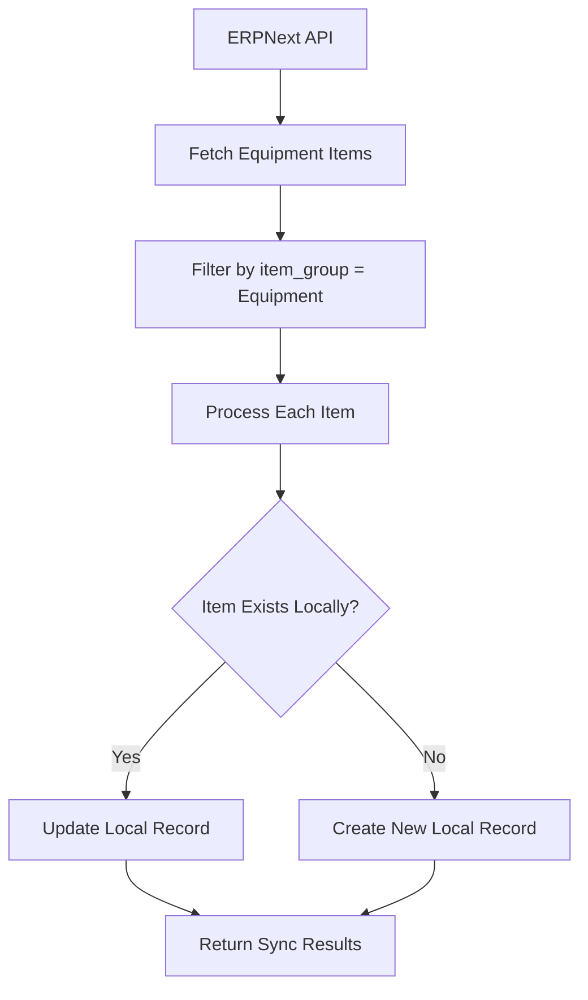

# ERPNext Equipment Integration

This document explains how the Next.js app integrates with ERPNext to fetch and sync equipment data.

## Overview

The ERPNext equipment integration allows the Next.js app to:
1. Fetch equipment data directly from ERPNext
2. Sync equipment from ERPNext to the local database
3. Display both local and ERPNext equipment data
4. Manage equipment synchronization

## Architecture

### Laravel Backend (Reference Implementation)

The Laravel backend already has a complete ERPNext integration:

**Key Files:**
- `snd-app/Modules/RentalManagement/Services/ERPNextClient.php` - Main ERPNext API client
- `snd-app/Modules/EquipmentManagement/Actions/SyncEquipmentFromERPNextAction.php` - Equipment sync logic
- `snd-app/Modules/EquipmentManagement/Http/Controllers/Api/EquipmentController.php` - API endpoints

**How Laravel Fetches Equipment:**
```php
// Fetch equipment from ERPNext
$filters = urlencode(json_encode([["item_group", "=", "Equipment"]]));
$endpoint = "/api/resource/Item?filters=$filters&limit_page_length=1000&fields=[\"name\",\"item_code\",\"item_name\",\"description\",\"item_group\",\"stock_uom\",\"disabled\",\"standard_rate\",\"last_purchase_rate\",\"valuation_rate\",\"stock_qty\",\"model\",\"serial_no\",\"manufacturer\"]";

$response = $this->client->get($endpoint);
$data = json_decode($response->getBody()->getContents(), true);
$equipmentItems = $data['data'] || [];
```

### Next.js Implementation

The Next.js app implements similar functionality with these components:

## API Endpoints

### 1. ERPNext Equipment API (`/api/erpnext/equipment`)

**GET** - Fetch equipment from ERPNext
- `?action=sync` - Trigger sync from ERPNext to local database
- Returns ERPNext equipment data

**POST** - Sync equipment from ERPNext
- Body: `{ "action": "sync" }`
- Syncs ERPNext equipment to local database

### 2. Equipment API (`/api/equipment`)

**GET** - Fetch equipment with ERPNext integration
- `?sync_erpnext=true` - Sync from ERPNext before fetching
- `?source=erpnext` - Fetch directly from ERPNext
- `?source=local` - Fetch from local database (default)

## Data Flow

### 1. ERPNext to Local Sync Process



### 2. Equipment Data Mapping

| ERPNext Field | Local Database Field | Description |
|---------------|---------------------|-------------|
| `item_name` | `name` | Equipment name |
| `item_code` | `erpnext_id` | ERPNext item code |
| `description` | `description` | Equipment description |
| `manufacturer` | `manufacturer` | Manufacturer name |
| `model` | `model_number` | Model number |
| `serial_no` | `serial_number` | Serial number |
| `standard_rate` | `daily_rate` | Daily rental rate |
| `disabled` | `is_active` | Equipment status |

## Implementation Details

### 1. ERPNext Client Service

The Next.js app uses a similar approach to Laravel's ERPNextClient:

```typescript
// ERPNext configuration
const ERPNEXT_URL = process.env.NEXT_PUBLIC_ERPNEXT_URL;
const ERPNEXT_API_KEY = process.env.ERPNEXT_API_KEY;
const ERPNEXT_API_SECRET = process.env.ERPNEXT_API_SECRET;

async function makeERPNextRequest(endpoint: string, options: RequestInit = {}) {
  const url = `${ERPNEXT_URL}${endpoint}`;
  const headers = {
    'Authorization': `token ${ERPNEXT_API_KEY}:${ERPNEXT_API_SECRET}`,
    'Content-Type': 'application/json',
    'Accept': 'application/json',
  };

  const response = await fetch(url, {
    ...options,
    headers: { ...headers, ...options.headers },
  });

  if (!response.ok) {
    throw new Error(`ERPNext API error: ${response.status} ${response.statusText}`);
  }

  return response.json();
}
```

### 2. Equipment Sync Logic

```typescript
async function syncEquipmentFromERPNext() {
  // Fetch equipment from ERPNext
  const filters = encodeURIComponent(JSON.stringify([["item_group", "=", "Equipment"]]));
  const endpoint = `/api/resource/Item?filters=${filters}&limit_page_length=1000&fields=[...]`;
  
  const erpData = await makeERPNextRequest(endpoint);
  const equipmentItems = erpData.data || [];

  let createdCount = 0;
  let updatedCount = 0;

  for (const item of equipmentItems) {
    if (item.disabled) continue;

    const equipmentData = {
      name: item.item_name || item.item_code,
      description: item.description || '',
      manufacturer: item.manufacturer || '',
      model_number: item.model || '',
      serial_number: item.serial_no || '',
      erpnext_id: item.item_code,
      daily_rate: item.standard_rate ? parseFloat(item.standard_rate) : null,
      status: 'available',
      is_active: true,
    };

    // Check if equipment exists
    const existingEquipment = await prisma.equipment.findFirst({
      where: {
        OR: [
          { erpnext_id: item.item_code },
          { serial_number: item.serial_no }
        ]
      }
    });

    if (existingEquipment) {
      await prisma.equipment.update({
        where: { id: existingEquipment.id },
        data: equipmentData
      });
      updatedCount++;
    } else {
      await prisma.equipment.create({
        data: equipmentData
      });
      createdCount++;
    }
  }

  return { created: createdCount, updated: updatedCount, total_processed: equipmentItems.length };
}
```

## Frontend Components

### 1. Equipment Management Page

The main equipment management page (`/modules/equipment-management`) provides:

- **Local Equipment Tab**: Shows equipment stored in local database
- **ERPNext Equipment Tab**: Shows equipment available in ERPNext
- **Sync Button**: Triggers synchronization from ERPNext
- **Search and Filter**: Filter equipment by status, search by name/model/manufacturer

### 2. ERPNext Integration Settings

The ERPNext integration settings page (`/modules/settings/erpnext-integration`) includes:

- **Equipment Sync**: Sync equipment from ERPNext
- **Connection Testing**: Test ERPNext API connection
- **Sync Status**: Track last sync results

### 3. Test Page

A dedicated test page (`/test-erpnext-equipment`) for:

- Testing ERPNext connection
- Loading local and ERPNext equipment
- Running sync operations
- Viewing sync results

## API Service Methods

The `ApiService` class includes these ERPNext equipment methods:

```typescript
// Get equipment with ERPNext integration options
static async getERPNextEquipment(params?: {
  sync_erpnext?: boolean;
  source?: 'erpnext' | 'local';
})

// Sync equipment from ERPNext
static async syncEquipmentFromERPNext()

// Get equipment directly from ERPNext
static async getERPNextEquipmentDirect()
```

## Environment Variables

Required environment variables:

```env
# ERPNext Configuration
NEXT_PUBLIC_ERPNEXT_URL=https://erp.snd-ksa.online
ERPNEXT_API_KEY=your_api_key
ERPNEXT_API_SECRET=your_api_secret

# App Configuration
NEXT_PUBLIC_APP_URL=http://localhost:3000
```

## Database Schema

The equipment table includes ERPNext integration fields:

```sql
CREATE TABLE equipment (
  id SERIAL PRIMARY KEY,
  name VARCHAR NOT NULL,
  description TEXT,
  manufacturer VARCHAR,
  model_number VARCHAR,
  serial_number VARCHAR,
  erpnext_id VARCHAR UNIQUE,  -- Links to ERPNext item_code
  daily_rate DECIMAL(12,2),
  status VARCHAR DEFAULT 'available',
  is_active BOOLEAN DEFAULT true,
  -- ... other fields
);
```

## Usage Examples

### 1. Sync Equipment from ERPNext

```typescript
// Using API Service
const result = await ApiService.syncEquipmentFromERPNext();
console.log(`Synced: ${result.data.created} created, ${result.data.updated} updated`);

// Direct API call
const response = await fetch('/api/erpnext/equipment?action=sync');
const result = await response.json();
```

### 2. Fetch Equipment with Sync

```typescript
// Fetch with automatic sync
const equipment = await ApiService.getERPNextEquipment({ 
  sync_erpnext: true 
});

// Fetch from specific source
const erpnextEquipment = await ApiService.getERPNextEquipment({ 
  source: 'erpnext' 
});
```

### 3. Test Integration

```typescript
// Test connection
const connectionTest = await fetch('/api/erpnext/test-connection');

// Load equipment from both sources
const localEquipment = await ApiService.getEquipment();
const erpnextEquipment = await ApiService.getERPNextEquipmentDirect();
```

## Error Handling

The implementation includes comprehensive error handling:

1. **Connection Errors**: Handle ERPNext API connection failures
2. **Data Validation**: Validate ERPNext response data
3. **Database Errors**: Handle Prisma database operation failures
4. **User Feedback**: Show appropriate success/error messages

## Monitoring and Logging

- Console logging for sync operations
- Toast notifications for user feedback
- Error tracking for debugging
- Sync result tracking

## Future Enhancements

1. **Real-time Sync**: Implement webhook-based real-time synchronization
2. **Bidirectional Sync**: Allow updates from local system to ERPNext
3. **Conflict Resolution**: Handle data conflicts between systems
4. **Batch Operations**: Support bulk equipment operations
5. **Audit Trail**: Track all sync operations and changes

## Troubleshooting

### Common Issues

1. **Connection Failed**: Check ERPNext URL and credentials
2. **No Equipment Found**: Verify ERPNext has items with `item_group = "Equipment"`
3. **Sync Errors**: Check database permissions and schema
4. **Rate Limiting**: Implement retry logic for ERPNext API limits

### Debug Steps

1. Test ERPNext connection: `/api/erpnext/test-connection`
2. Check environment variables
3. Verify ERPNext API credentials
4. Test individual API endpoints
5. Review console logs for errors

This integration provides a robust foundation for ERPNext equipment synchronization while maintaining the flexibility to work with both local and remote data sources. 